---
## Front matter
title: "Лабораторная работа №2"
subtitle: "Архитектура компьютера"
author: "Скрипник Виктория Дмитриевна"

## Generic otions
lang: ru-RU
toc-title: "Содержание"

## Bibliography
bibliography: bib/cite.bib
csl: pandoc/csl/gost-r-7-0-5-2008-numeric.csl

## Pdf output format
toc: true # Table of contents
toc-depth: 2
lof: true # List of figures
lot: true # List of tables
fontsize: 12pt
linestretch: 1.5
papersize: a4
documentclass: scrreprt
## I18n polyglossia
polyglossia-lang:
  name: russian
  options:
	- spelling=modern
	- babelshorthands=true
polyglossia-otherlangs:
  name: english
## I18n babel
babel-lang: russian
babel-otherlangs: english
## Fonts
mainfont: IBM Plex Serif
romanfont: IBM Plex Serif
sansfont: IBM Plex Sans
monofont: IBM Plex Mono
mathfont: STIX Two Math
mainfontoptions: Ligatures=Common,Ligatures=TeX,Scale=0.94
romanfontoptions: Ligatures=Common,Ligatures=TeX,Scale=0.94
sansfontoptions: Ligatures=Common,Ligatures=TeX,Scale=MatchLowercase,Scale=0.94
monofontoptions: Scale=MatchLowercase,Scale=0.94,FakeStretch=0.9
mathfontoptions:
## Biblatex
biblatex: true
biblio-style: "gost-numeric"
biblatexoptions:
  - parentracker=true
  - backend=biber
  - hyperref=auto
  - language=auto
  - autolang=other*
  - citestyle=gost-numeric
## Pandoc-crossref LaTeX customization
figureTitle: "Рис."
tableTitle: "Таблица"
listingTitle: "Листинг"
lofTitle: "Список иллюстраций"
lotTitle: "Список таблиц"
lolTitle: "Листинги"
## Misc options
indent: true
header-includes:
  - \usepackage{indentfirst}
  - \usepackage{float} # keep figures where there are in the text
  - \floatplacement{figure}{H} # keep figures where there are in the text
---

# Цель работы

Выполнение настройки и работы с системой контроля версий Git.

# Задание

1. Создайте отчет по выполнению лабораторной работы в соответствующем каталоге
рабочего пространства (labs>lab02>report).
2. Скопируйте отчеты по выполнению предыдущих лабораторных работ в соответствую-
щие каталоги созданного рабочего пространства.
3. Загрузите файлы на github.

# Теоретическое введение

Здесь описываются теоретические аспекты, связанные с выполнением работы.

Например, в табл. [-@tbl:std-dir] приведено краткое описание стандартных каталогов Unix.

: Описание некоторых каталогов файловой системы GNU Linux {#tbl:std-dir}

| Имя каталога | Описание каталога                                                                                                          |
|--------------|----------------------------------------------------------------------------------------------------------------------------|
| `/`          | Корневая директория, содержащая всю файловую                                                                               |
| `/bin `      | Основные системные утилиты, необходимые как в однопользовательском режиме, так и при обычной работе всем пользователям     |
| `/etc`       | Общесистемные конфигурационные файлы и файлы конфигурации установленных программ                                           |
| `/home`      | Содержит домашние директории пользователей, которые, в свою очередь, содержат персональные настройки и данные пользователя |
| `/media`     | Точки монтирования для сменных носителей                                                                                   |
| `/root`      | Домашняя директория пользователя  `root`                                                                                   |
| `/tmp`       | Временные файлы                                                                                                            |
| `/usr`       | Вторичная иерархия для данных пользователя                                                                                 |

Более подробно про Unix см. в [@tanenbaum_book_modern-os_ru; @robbins_book_bash_en; @zarrelli_book_mastering-bash_en; @newham_book_learning-bash_en].

# Выполнение лабораторной работы

1. Базовая настройка git.
Открываю терминал репозитория имя и email своего репозитория.(рис.1.1 [-@fig:001]).

{#fig:001 width=100%}

Настроим utf-8 в выводе сообщений git, зададим имя начальной ветке
(будем называть её master), укажем значение параметров autocrlf и
safecrlf.(рис.1.2 [-@fig:001]).

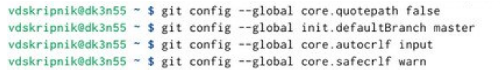{#fig:001 width=100%}

2. Создание SSH ключа.
Для последующей идентификации пользователя на сервере репозиториев
создаю пару ключей(приватный и открытый)(рис.2.1 [-@fig:001]).

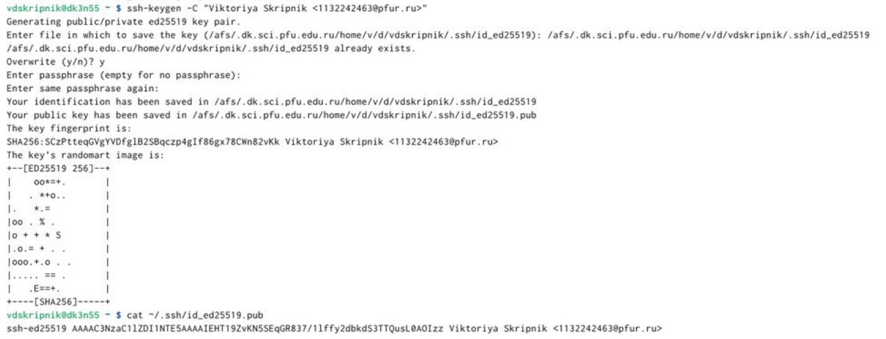{#fig:001 width=100%}

Созданный SSH ключ сохраняю на git е и указываю для ключа имя (Title).
(рис.2.2 [-@fig:001]).

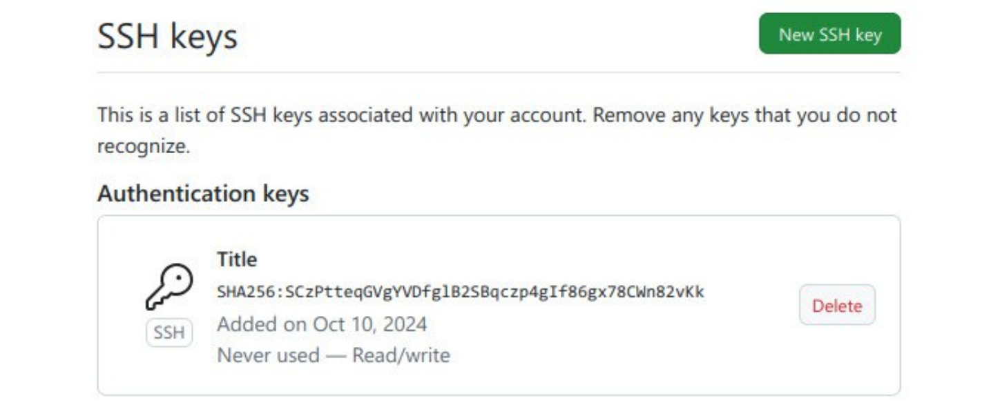{#fig:001 width=100%}

3. Сознание рабочего пространства и репозитория курса на
основе шаблона.
Создаю каталог (2024-2025 «Архитектура компьютера») с помощью
команды mkdir -p(рис.3.1 [-@fig:001]).

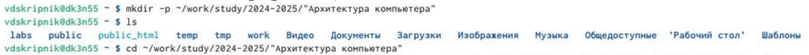{#fig:001 width=100%}

4. Создание репозитория курса на основе шаблона.
Перехожу на страницу репозитория и выбираю Use this template
В открывшемся окне задаю имя репозитория study_2024–2025_arhpc и
создаю репозиторий (Create repository from template).(рис.4.1 [-@fig:001]).

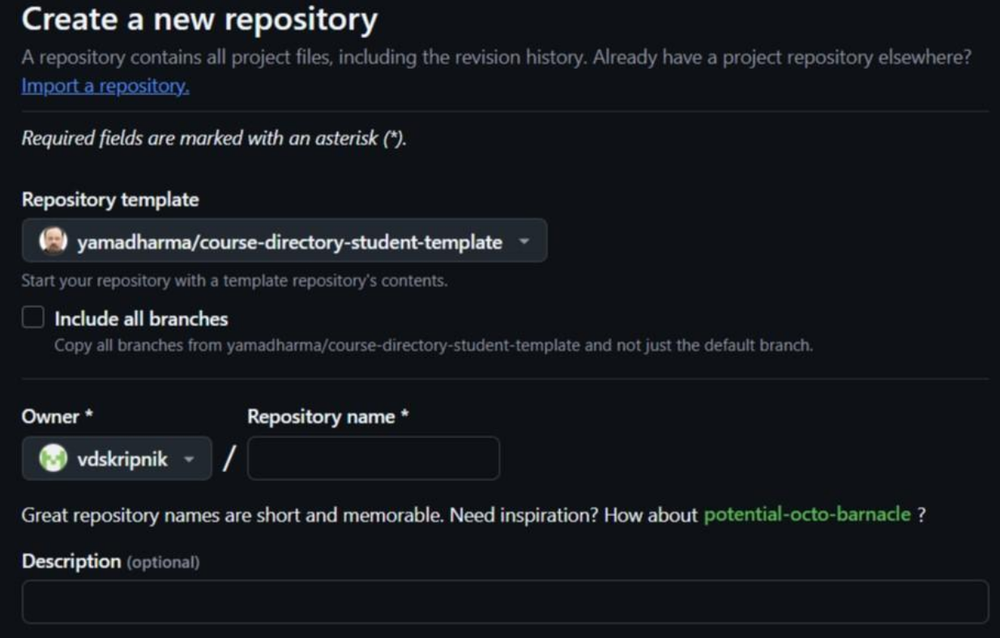{#fig:001 width=100%}

Клонирую созданный репозиторий.(рис.4.2 [-@fig:001]).

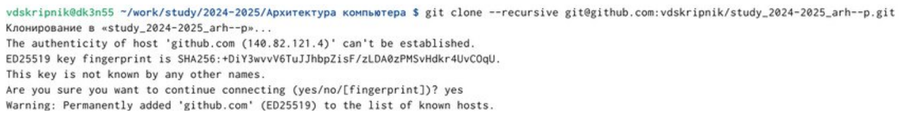{#fig:001 width=100%}

Копирую ссылку для
клонирования на странице созданного репозитория Code.(рис.4.3 [-@fig:001]).

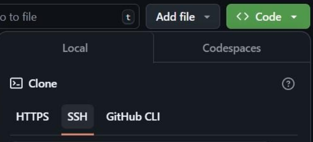{#fig:001 width=100%}

5. Настройка каталога курса.
Перехожу в каталог курса 2023-2024"Архитектура компьютера"/arch-pc и
удаляю лишние файлы с помощь rm package.json.(рис.5.1 [-@fig:001]).

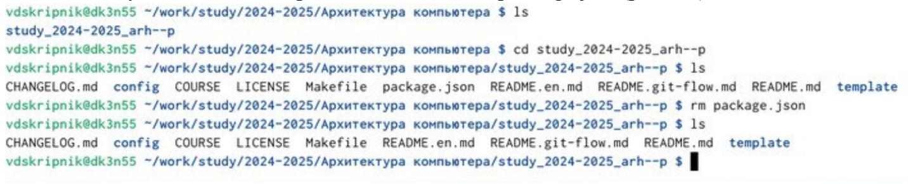{#fig:001 width=100%}

Создаю необходимые каталоги.(рис.5.2 [-@fig:001]).

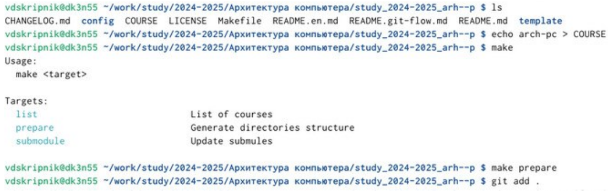{#fig:001 width=100%}

Далее отправляю файлы на сервер.(рис.5.3 [-@fig:001]).

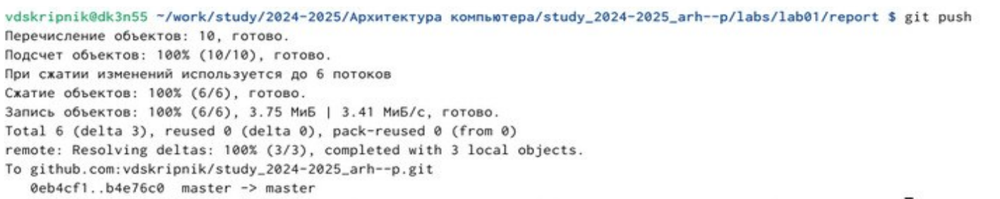{#fig:001 width=100%}

Проверяю правильность создания иерархии рабочего пространства в
локальном репозитории и на странице github.(рис.5.4 [-@fig:001]).

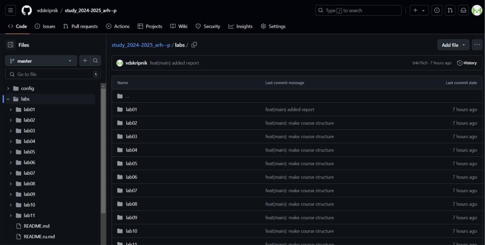{#fig:001 width=100%}

6. Задание для самостоятельной работы.

Сначала создаю отчет по выполнению лабораторной работы в
соответствующем каталоге рабочего пространства (labs>lab02>report) и
загруаю все файлы на github.(рис.6.1 [-@fig:001]).

{#fig:001 width=100%}

# Выводы

В ходе выполнения лабораторной работы я обрела
теоретические и практические знания в использовании Linux и
github, создавать SSH ключ и создавать репозиторий на git.

# Список литературы{.unnumbered}

::: {#refs}
:::
